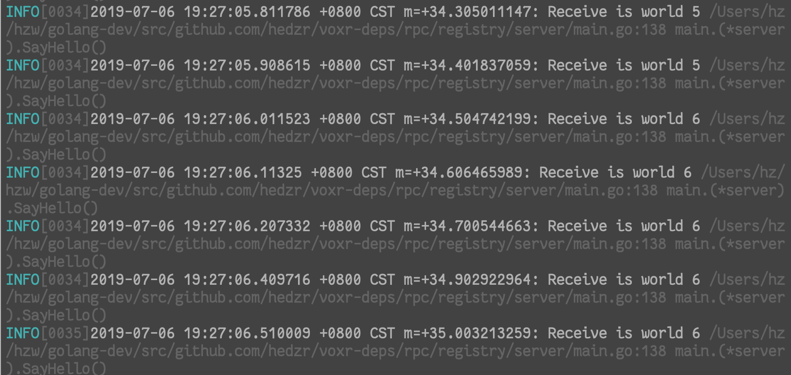

# logex


<!-- ](https://travis-ci.org/hedzr/logex) -->
[](https://github.com/hedzr/logex/releases)
[](https://sourcegraph.com/github.com/hedzr/logex?badge)

an enhanced for logrus. `logex` append the context call info to the log.





## Usage

```go
import "github.com/hedzr/logex"

func init(){
	logex.Enable()
    // Or:
    logex.EnableWith(logrus.DebugLevel)
}
```


### ignore the extra caller frames

If you are writing logging func wrappers, you might ignore the extra caller frames for those wrappers:

```go
func wrong(err error, fmt string, args interface{}) {
    logrus.WithError(err).WithFields(logrus.Fields{
        logex.SKIP: 1,  // ignore wrong() frame
    }).Errorf(fmt, args)
}

func wrongInner(err error, fields logrus.Fields, fmt string, args interface{}) {
    logrus.WithError(err).WithFields(fields).Errorf(fmt, args)
}

func wrongwrong(err error, fmt string, args interface{}) {
    wrongInner(err, logrus.Fields{
        logex.SKIP: 2,  // ignore wrongwrong() and wrongInner() frame
    }, fmt, args...)
}
```


### import `logex` from gopkg.in:

```go
import "gopkg.in/hedzr/logex.v1"
```


## make `logrus` works in `go test`

The codes is copied from:

<https://github.com/sirupsen/logrus/issues/834>

And in a test function, you could code now:

```go
   func TestFoo(t *testing.T) {
     defer logex.CaptureLog(t).Release()
     // …
   }
```


## LICENSE

MIT
